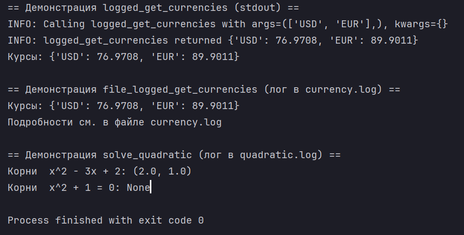
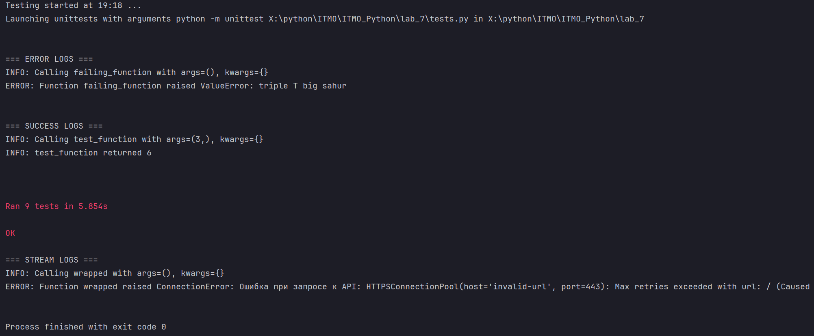
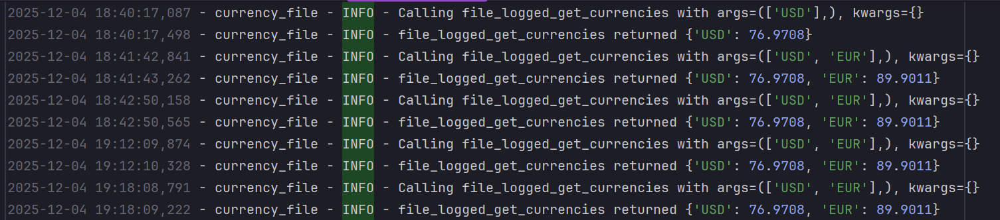
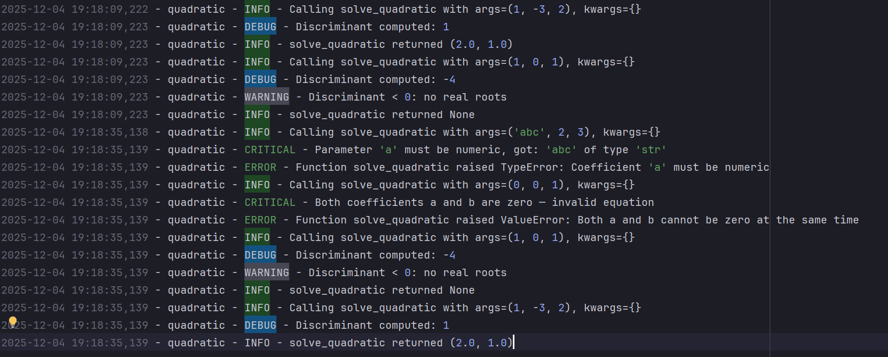

title: Логирование и обработка ошибок в Python

---

## 🎯 Цели работы

- освоить принципы разработки декораторов с параметрами;
- научиться разделять ответственность функций (бизнес-логика) и декораторов (сквозная логика);
- научиться обрабатывать исключения, возникающие при работе с внешними API;
- освоить логирование в разные типы потоков (sys.stdout, io.StringIO, logging);
- научиться тестировать функцию и поведение логирования.

---

## 📌 1. Исходный код декоратора `logger`

```python
def logger(func: FuncType | None = None, *,
           handle: LoggerOrStream = sys.stdout) -> FuncType:
    """
    Декоратор для логирования вызовов функций.

    Поддерживает три варианта аргумента ``handle``:

    1. Обычный поток вывода (по умолчанию): ``sys.stdout``.
    2. Любой файловый поток (например, ``io.StringIO()``).
    3. Объект ``logging.Logger``.

    Вариант выбирается автоматически:

    * если ``handle`` является экземпляром ``logging.Logger``,
      то используются методы ``info()`` и ``error()``;
    * иначе предполагается, что это файловый поток с методом ``write()``.

    При вызове функции логируются:

    * INFO: старт вызова + аргументы;
    * INFO: успешное завершение + результат.

    При возникновении исключения:

    * ERROR: тип и текст исключения;
    * исключение пробрасывается дальше без изменения типа.

    Параметризуемый декоратор: может использоваться как
    ``@logger`` и как ``@logger(handle=...)``.
    """

    def _decorate(fn: FuncType) -> FuncType:
        if isinstance(handle, logging.Logger):
            info = handle.info
            error = handle.error
        else:

            def info(message: str) -> None:
                handle.write(f"INFO: {message}\n")

            def error(message: str) -> None:
                handle.write(f"ERROR: {message}\n")

        @functools.wraps(fn)
        def wrapper(*args: Any, **kwargs: Any) -> Any:
            info(f"Calling {fn.__name__} with args={args}, kwargs={kwargs}")
            try:
                result = fn(*args, **kwargs)
            except Exception as e:
                error(
                    f"Function {fn.__name__} raised {type(e).__name__}: {e}"
                )
                raise
            else:
                info(f"{fn.__name__} returned {result!r}")
                return result

        return wrapper

    if func is None:
        return _decorate
    return _decorate(func)
````

Полный код см. в файле `logging_utils.py`.

---

## 📌 2. Исходный код функции `get_currencies`

Функция содержит только бизнес-логику.
Все исключения должны выбрасываться наружу, а логирование выполняет декоратор.

```python
def get_currencies(
        currency_codes: Iterable[str],
        url: str = "https://www.cbr-xml-daily.ru/daily_json.js",
        timeout: float = 5.0,
) -> dict[str, float]:
    """
    Получить курсы указанных валют с API ЦБ РФ.

    Параметры
    ---------
    currency_codes:
        Итерируемый объект с символьными кодами валют
         (например, ['USD', 'EUR']).
    url:
        URL API ЦБ РФ или тестовый URL.
    timeout:
        Таймаут HTTP-запроса в секундах.

    Возвращает
    ----------
    dict[str, float]
        Словарь вида {"USD": 93.25, "EUR": 101.7}.

    Исключения
    ----------
    ConnectionError
        Если API недоступен или произошла сетевая ошибка.
    ValueError
        Если ответ не удаётся распарсить как корректный JSON.
    KeyError
        Если отсутствует ключ ``"Valute"`` или указанная валюта.
    TypeError
        Если курс валюты имеет некорректный тип (не число).
    """
    try:
        response = requests.get(url, timeout=timeout)
        response.raise_for_status()
    except requests.exceptions.RequestException as e:
        raise ConnectionError(f"Ошибка при запросе к API: {e}") from e

    try:
        data = response.json()
    except ValueError as e:
        raise ValueError("Некорректный JSON в ответе API") from e

    try:
        valute_dict = data["Valute"]
    except KeyError as e:
        raise KeyError('В ответе JSON отсутствует ключ "Valute"') from e

    result: dict[str, float] = {}
    for code in currency_codes:
        try:
            currency_info = valute_dict[code]
        except KeyError as e:
            raise KeyError(f"Валюта {code!r} отсутствует в данных API") from e

        value = currency_info.get("Value")
        if not isinstance(value, (int, float)):
            raise TypeError(
                f"Курс валюты {code!r} имеет неверный тип:"
                f" {type(value).__name__}"
            )

        result[code] = float(value)

    return result
```

---

## 📌 3. Демонстрационный пример: решение квадратного уравнения

Функция логирует:

* **INFO** — начало/конец вызова (через декоратор);
* **WARNING** — дискриминант < 0;
* **ERROR / CRITICAL** — некорректные параметры.

```python
@logger(handle=quad_logger)
def solve_quadratic(a: float, b: float, c: float) -> tuple[float, ...] | None:
    """
    Решить квадратное уравнение ``a * x^2 + b * x + c = 0``.

    Логирование:

    * INFO — старт/конец (обрабатывается декоратором);
    * WARNING — дискриминант < 0 (нет действительных корней);
    * ERROR/CRITICAL — некорректные данные
      (через декоратор и дополнительно внутри функции).
    """

    for name, value in zip(("a", "b", "c"), (a, b, c)):
        if not isinstance(value, (int, float)):
            quad_logger.critical(
                f"Parameter {name!r} must be numeric, got:"
                f" {value!r} of type {type(value).__name__!r}")
            raise TypeError(f"Coefficient '{name}' must be numeric")

    if a == 0 and b == 0:
        quad_logger.critical(
            "Both coefficients a and b are zero — invalid equation")
        raise ValueError("Both a and b cannot be zero at the same time")

    if a == 0:
        quad_logger.error("Coefficient 'a' is zero — equation is not quadratic")
        raise ValueError(
            "Coefficient 'a' cannot be zero for quadratic equation")

    d = b * b - 4 * a * c
    quad_logger.debug(f"Discriminant computed: {d}")

    if d < 0:
        quad_logger.warning("Discriminant < 0: no real roots")
        return None

    if d == 0:
        x = -b / (2 * a)
        return (x,)

    x1 = (-b + math.sqrt(d)) / (2 * a)
    x2 = (-b - math.sqrt(d)) / (2 * a)
    return x1, x2


def demo() -> None:
    """Небольшая демонстрация работы функций при запуске файла напрямую."""
    print("== Демонстрация logged_get_currencies (stdout) ==")
    try:
        rates = logged_get_currencies(["USD", "EUR"])
        print("Курсы:", rates)
    except Exception as e:
        print("Ошибка при получении курсов:", e)

    print(
        "\n== Демонстрация file_logged_get_currencies (лог в currency.log) ==")
    try:
        rates = file_logged_get_currencies(["USD", "EUR"])
        print("Курсы:", rates)
        print("Подробности см. в файле currency.log")
    except Exception as e:
        print("Ошибка при получении курсов:", e)

    print("\n== Демонстрация solve_quadratic (лог в quadratic.log) ==")
    try:
        print("Корни  x^2 - 3x + 2:", solve_quadratic(1, -3, 2))
        print("Корни  x^2 + 1 = 0:", solve_quadratic(1, 0, 1))
    except Exception as e:
        print("Ошибка при решении квадратного уравнения:", e)
```

---

## 📌 4. Примеры логов

### ✔ 4.1 Логирование в stdout

*(Скриншот из демонстрации)*



---

### ✔ 4.2 Логирование в тестах



---

## 📌 5. Тестирование

Тесты находятся в файле `tests.py`.

### ✔ 5.1 Тесты функции `get_currencies`

Проверяют:

* корректность полученного курса;
* выброс `KeyError` для отсутствующей валюты;
* выброс `ConnectionError` при неверном URL.

```python
class TestGetCurrencies(unittest.TestCase):
    """Тесты бизнес-логики функции get_currencies."""

    def test_real_usd_rate(self) -> None:
        """Проверяем, что курс USD возвращается и имеет разумное значение."""
        data = get_currencies(["USD"])
        self.assertIn("USD", data)
        self.assertIsInstance(data["USD"], float)
        self.assertGreaterEqual(data["USD"], 0.0)
        self.assertLessEqual(data["USD"], MAX_RATE_VALUE)

    def test_missing_currency_raises_key_error(self) -> None:
        """Неизвестная валюта должна вызывать KeyError."""
        with self.assertRaises(KeyError):
            get_currencies(["NON_EXISTENT_CURRENCY_CODE"])

    def test_connection_error(self) -> None:
        """
        Неверный URL должен приводить к ConnectionError.

        В реальном тесте лучше мокать requests.get,
        но для простоты используем заведомо некорректный URL.
        """
        with self.assertRaises(ConnectionError):
            get_currencies(["USD"], url="https://invalid-url")
```

---

### ✔ 5.2 Тестирование декоратора logger через StringIO

Проверяются:

* логи INFO при успешном вызове,
* логи ERROR при исключениях,
* проброс исключений без потери типа.

```python
class TestLoggerDecorator(unittest.TestCase):
    """Тестирование поведения декоратора logger через io.StringIO."""

    def setUp(self) -> None:
        self.stream = io.StringIO()

        @logger(handle=self.stream)
        def test_function(x: int) -> int:
            return x * 2

        @logger(handle=self.stream)
        def failing_function() -> None:
            raise ValueError("triple T big sahur")

        self.test_function = test_function
        self.failing_function = failing_function

    def test_logging_success(self) -> None:
        """При успешном выполнении должны быть INFO-логи о старте и завершении."""
        result = self.test_function(3)
        self.assertEqual(result, 6)

        logs = self.stream.getvalue()
        self.assertIn("INFO:", logs)
        self.assertIn("Calling test_function", logs)
        self.assertIn("returned 6", logs)

        print("\n=== SUCCESS LOGS ===")
        print(logs)


    def test_logging_error_and_exception_propagation(self) -> None:
        """При ошибке должен быть ERROR и исключение проброшено дальше."""
        with self.assertRaises(ValueError):
            self.failing_function()

        logs = self.stream.getvalue()
        self.assertIn("ERROR:", logs)
        self.assertIn("ValueError", logs)
        self.assertIn("triple T big sahur", logs)

        print("\n=== ERROR LOGS ===")
        print(logs)
```

---

### ✔ 5.3 Тест контекстного вызова из задания

Проверяется, что декоратор логирует ошибку при недоступном API.

```python
class TestStreamWriteExample(unittest.TestCase):
    """
    Пример теста с контекстом из задания.

    Используем декоратор logger и StringIO.
    """

    def setUp(self) -> None:
        self.stream = io.StringIO()

        @logger(handle=self.stream)
        def wrapped() -> dict[str, float]:
            return get_currencies(["USD"],
                                  url="https://invalid-url")

        self.wrapped = wrapped

    def test_logging_error(self) -> None:
        """Проверяем, что ошибка логируется и исключение пробрасывается."""
        with self.assertRaises(ConnectionError):
            self.wrapped()

        logs = self.stream.getvalue()
        self.assertIn("ERROR:", logs)
        self.assertIn("ConnectionError", logs)

        print("\n=== STREAM LOGS ===")
        print(logs)
```

---

### ✔ 5.4 Тесты функции solve_quadratic

Проверяются:

* два корня,
* отсутствие корней при d < 0,
* ошибки при некорректных параметрах.

```python
class TestSolveQuadratic(unittest.TestCase):
    """Краткая проверка solve_quadratic."""

    def test_two_roots(self) -> None:
        """Уравнение x^2 - 3x + 2 = 0 имеет два корня: 1 и 2."""
        roots = solve_quadratic(1, -3, 2)
        self.assertIsNotNone(roots)
        self.assertAlmostEqual(sorted(roots)[0], 1.0)
        self.assertAlmostEqual(sorted(roots)[1], 2.0)

    def test_negative_discriminant(self) -> None:
        """При d < 0 возвращается None."""
        roots = solve_quadratic(1, 0, 1)
        self.assertIsNone(roots)

    def test_invalid_coefficients(self) -> None:
        """Некорректные коэффициенты должны вызывать исключения."""
        with self.assertRaises(TypeError):
            solve_quadratic("abc", 2, 3)

        with self.assertRaises(ValueError):
            solve_quadratic(0, 0, 1)
```

---

## 📌 6. Логи в файлах currency.log и quadratic.log





---

## ✔ 7. Вывод

В ходе выполнения работы было разработано:

* параметризуемый декоратор `logger`, умеющий логировать:

  * в stdout;
  * в любой файловый поток (в т.ч. StringIO);
  * в объект logging.Logger;
* функция get_currencies с корректной обработкой ошибок;
* демонстрационный пример solve_quadratic с многоуровневым логированием;
* полный набор модульных тестов для:

  * бизнес-логики,
  * логирования,
  * обработки ошибок.

Все цели работы выполнены.

Ломаченко Ян (P3120, 505115)
