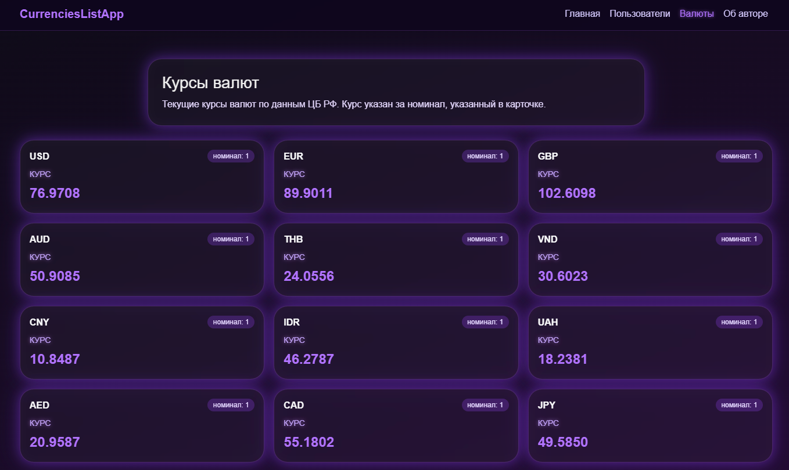
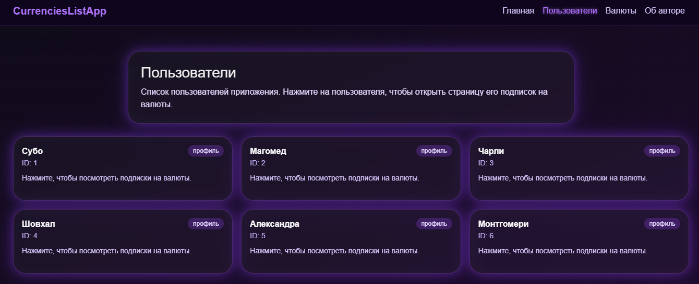
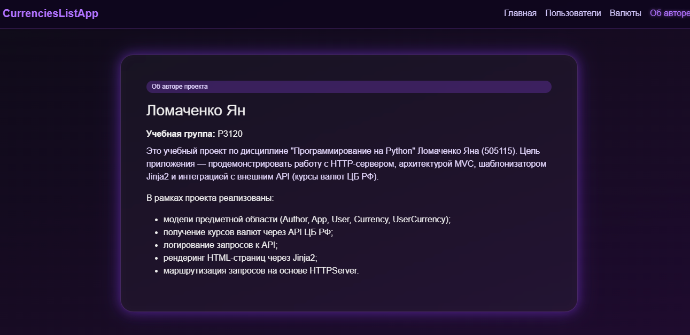
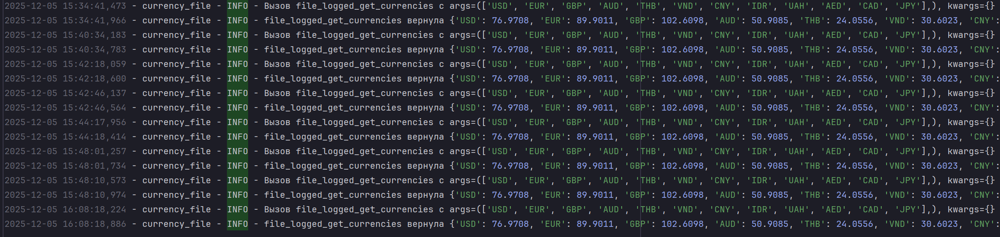
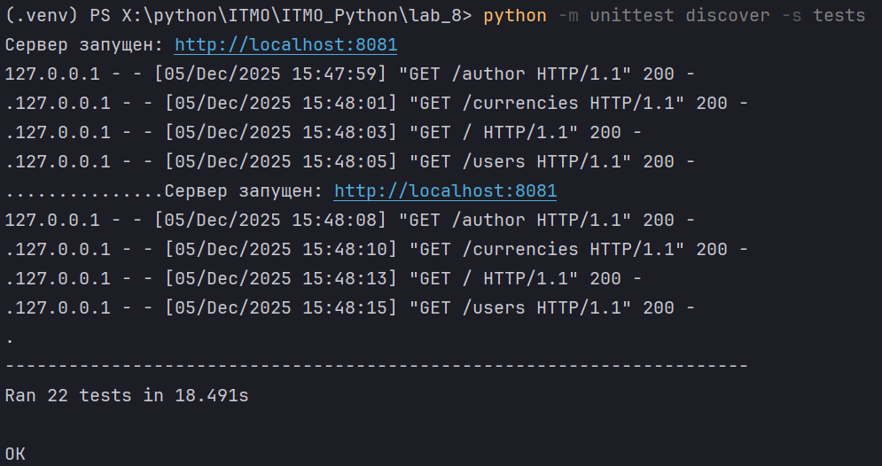

title: Клиент-серверное приложение на Python с использованием Jinja2

**Студент:** Ломаченко Ян Станиславович (505115)

**Группа:** P3120

---

# **1. Цель работы**

Целью лабораторной работы является разработка простого клиент-серверного приложения на Python **без использования серверных фреймворков**, с применением:

* Создать простое клиент-серверное приложение на Python без серверных фреймворков;
* Освоить работу с HTTPServer и маршрутизацию запросов;
* Применять шаблонизатор Jinja2 для отображения данных;
* Реализовать модели предметной области (User, Currency, UserCurrency, App, Author) с геттерами и сеттерами;
* Структурировать код в соответствии с архитектурой MVC;
* геттеров и сеттеров для валидации данных;
* Получать данные о курсах валют через функцию get_currencies и отображать их пользователям;
* Реализовать функциональность подписки пользователей на валюты и отображение динамики их изменения;
* Научиться создавать тесты для моделей и серверной логики.

---

# **2. Описание предметной области**

Приложение позволяет:

* просматривать актуальные курсы валют;
* отображать список пользователей;
* показывать, на какие валюты подписан конкретный пользователь;
* управлять моделью приложения и информацией об авторе.

Используются следующие сущности:

---

## **2.1. Модель Author**

Описывает автора программного проекта.

| Свойство | Описание       |
| -------- | -------------- |
| `name`   | имя автора     |
| `group`  | учебная группа |

---

## **2.2. Модель App**

Хранит информацию о приложении.

| Свойство  | Описание            |
| --------- | ------------------- |
| `name`    | название приложения |
| `version` | версия              |
| `author`  | объект Author       |

---

## **2.3. Модель User**

Описывает пользователя приложения.

| Свойство | Описание                 |
| -------- | ------------------------ |
| `id`     | уникальный идентификатор |
| `name`   | имя пользователя         |

---

## **2.4. Модель Currency**

Представляет валюту, полученную из API ЦБ РФ.

| Свойство    | Описание            |
| ----------- | ------------------- |
| `id`        | уникальный ID       |
| `num_code`  | цифровой код валюты |
| `char_code` | символьный код      |
| `name`      | название валюты     |
| `value`     | текущий курс        |
| `nominal`   | номинал валюты      |


---

## **2.5. Модель UserCurrency**

Реализует связь «много ко многим» между User и Currency.

| Свойство          | Описание                |
| ----------------- | ----------------------- |
| `subscription_id` | ID подписки             |
| `user_id`         | внешний ключ к User     |
| `currency_id`     | внешний ключ к Currency |

---

# **3. Архитектура проекта (MVC)**

Проект структурирован по архитектурному принципу **Model–View–Controller**.

---

## **3.1. Структура папок**

```
myapp/
├── models/
│   ├── __init__.py
│   ├── author.py
│   ├── app.py
│   ├── user.py
│   ├── currency.py
│   └── user_currency.py
├── templates/
│   ├── index.html
│   ├── author.html    
│   ├── users.html
│   └── currencies.html
├── static/
│   └── изображения
├── utils/
│   └── currencies_api.py
├── tests/
│   ├── test_models.py
│   ├── test_currencies.py
│   └── test_myapp_controller.py
└── myapp.py
```

---

## **3.2. Разделение ответственности (MVC)**

### **Models (models/)**

Отвечают за хранение данных, геттеры, сеттеры, проверки типов, бизнес-логику.

### **Views (templates/)**

HTML-шаблоны Jinja2.
Содержат только отображение, без вычислительной логики.

### **Controller (myapp.py)**

HTTPServer + маршруты:

* `/` — главная
* `/users` — список пользователей
* `/currencies` — список валют
* `/author` — информация об авторе

---

# **4. Описание реализации**

---

## **4.1. Реализация моделей**

Каждая модель хранит данные в приватных атрибутах (`__id`, `__name`) и предоставляет доступ через свойства.

Пример сеттера:

```python
@value.setter
def value(self, value):
    if not isinstance(value, (int, float)):
        raise TypeError("Курс валюты должен быть числом.")
    if value <= 0:
        raise ValueError("Курс валюты должен быть положительным.")
    self.__value = float(value)
```

Преимущества:

* защита от некорректных данных;
* строгая типизация;
* изоляция логики валидации.

---

## **4.2. Реализация сервера**

Используется стандартная библиотека:

```python
from http.server import HTTPServer, BaseHTTPRequestHandler
```

Парсинг параметров:

```python
from urllib.parse import urlparse, parse_qs
```

Пример маршрутизации:

```python
if path == "/":
    self.render_index()
elif path == "/users":
    self.render_users()
elif path.startswith("/user"):
    query = parse_qs(parsed.query)
    self.render_user_page(query.get("id"))
```

Контроллер вызывает рендер шаблона и отправляет HTML клиенту.

---

## **4.3. Использование Jinja2**

Инициализация выполняется **один раз**:

```python
env = Environment(
    loader=PackageLoader("myapp"),
    autoescape=select_autoescape()
)
```

Преимущества:

* шаблоны загружаются из `myapp/templates`;
* Jinja2 кэширует шаблоны;
* повторный рендер работает быстро.

Получение шаблона:

```python
template_index = env.get_template("index.html")
```

Рендер:

```python
html = template_index.render(
    myapp="CurrenciesListApp",
    author_name=author.name,
    group=author.group
)
```

---

## **4.4. Интеграция get_currencies**

Функция из `utils/currencies_api.py`:

```python
def get_currencies(
        currency_codes: Iterable[str],
        url: str = "https://www.cbr-xml-daily.ru/daily_json.js",
        timeout: float = 5.0,
) -> dict[str, float]:
    """
    Получить курсы указанных валют с API ЦБ РФ.

    Параметры
    ---------
    currency_codes:
        Итерируемый объект с символьными кодами валют
        (например, ['USD', 'EUR']).
    url:
        URL API ЦБ РФ или тестовый URL.
    timeout:
        Таймаут HTTP-запроса в секундах.

    Возвращает
    ----------
    dict[str, float]
        Словарь вида {"USD": 93.25, "EUR": 101.7}.

    Исключения
    ----------
    ConnectionError
        Если API недоступен или произошла сетевая ошибка.
    ValueError
        Если ответ не удаётся распарсить как корректный JSON.
    KeyError
        Если отсутствует ключ "Valute" или указанная валюта.
    TypeError
        Если курс валюты имеет некорректный тип (не число).
    """
    try:
        response = requests.get(url, timeout=timeout)
        response.raise_for_status()
    except requests.exceptions.RequestException as e:
        raise ConnectionError(f"Ошибка при запросе к API: {e}") from e

    try:
        data = response.json()
    except ValueError as e:
        raise ValueError("Некорректный JSON в ответе API") from e

    try:
        valute_dict = data["Valute"]
    except KeyError as e:
        raise KeyError('В ответе JSON отсутствует ключ "Valute"') from e

    result: dict[str, float] = {}
    for code in currency_codes:
        try:
            currency_info = valute_dict[code]
        except KeyError as e:
            raise KeyError(f"Валюта {code!r} отсутствует в данных API") from e

        value = currency_info.get("Value")
        if not isinstance(value, (int, float)):
            raise TypeError(f"Курс валюты {code!r} имеет неверный тип:"
                            f" {type(value).__name__}"
            )

        result[code] = float(value)

    return result
```

Сервер:

1. вызывает функцию;
2. создаёт объекты Currency;
3. передаёт их в шаблон `currencies.html`.

---

# **5. Примеры работы приложения**







---

# **6. Тестирование**

Для проверки работоспособности были разработаны модульные тесты (unittest).

---

# **6.1 Тестирование моделей**

Тесты моделей находились в файле:

```
tests/test_models.py
```

Цель тестирования — убедиться, что:

* геттеры и сеттеры работают корректно,
* выполняется строгая проверка типов,
* при некорректных данных выбрасываются исключения `ValueError` и `TypeError`,
* корректные данные успешно создают экземпляры моделей.

## ✔ Тестирование модели Author

Проверялось:

* корректное создание объекта;
* валидация имени (минимум 2 символа);
* валидация группы;
* выброс исключений при неверных типах.

Пример:

```python
with self.assertRaises(ValueError):
    Author(name="", group="P3120")
```

---

## ✔ Тестирование модели App

Проверялось:

* корректная привязка объекта Author;
* валидация имени и версии;
* проверка того, что в поле `author` допускается только объект класса Author.

Пример:

```python
with self.assertRaises(ValueError):
    app.author = "не автор"
```

---

## ✔ Тестирование модели User

Проверялось:

* ID должен быть положительным целым числом;
* имя должно быть строкой и не пустой;
* выбрасываются ошибки при неправильных типах.

Пример:

```python
with self.assertRaises(ValueError):
    User(user_id="1", name="Имя")
```

---

## ✔ Тестирование модели Currency

Проверялось:

* корректность типов для числа, номинала, кодов;
* значение курса должно быть **положительным числом**;
* попытка передать строковое значение вызывает `ValueError`.

Пример:

```python
with self.assertRaises(ValueError):
    Currency(1, 840, "USD", "Доллар", -10, 1)
```

---

## ✔ Тестирование модели UserCurrency

Так как в проекте UserCurrency реализована через три поля:

```python
subscription_id
user_id
currency_id
```

Проверялось:

* валидация каждого ID (целое и положительное),
* корректное создание объекта.

Пример:

```python
uc = UserCurrency(subscription_id=1, user_id=1, currency_id=10)
self.assertEqual(uc.subscription_id, 1)
```

Также тесты проверяли корректный выброс исключений:

```python
with self.assertRaises(ValueError):
    UserCurrency(subscription_id=1, user_id="1", currency_id=10)
```

---

# **6.2 Тестирование функции get_currencies**

Файл:

```
tests/test_currencies_api.py
```

Проверялось:

### ✔ получение корректных данных с API

Был выполнен запрос к сайту ЦБ РФ:

```python
rates = get_currencies(["USD", "EUR"])
self.assertIn("USD", rates)
self.assertGreater(rates["USD"], 0)
```

### ✔ выброс исключений при ошибках

* несуществующий код валюты → KeyError
* неверный URL → ConnectionError
* некорректный JSON → ValueError

Пример теста:

```python
with self.assertRaises(KeyError):
    get_currencies(["FAKE"])
```

---

# **6.3 Тестирование контроллера**

Файл:

```
tests/test_controller.py
```

Поскольку приложение использует `HTTPServer`, для тестов он запускался на временном порту:

При тестировании проверялось, что сервер корректно отвечает на маршруты:

| Маршрут       | Описание             | Ожидаемый статус |
| ------------- | -------------------- | ---------------- |
| `/`           | главная страница     | 200              |
| `/users`      | список пользователей | 200              |
| `/currencies` | курсы валют          | 200              |
| `/author`     | информация об авторе | 200              |

Пример теста:

```python
response = requests.get("http://localhost:8081/users")
self.assertEqual(response.status_code, 200)
```


---

# **6.4 Результаты тестирования**

Вывод консоли после запуска:




Это означает:

* все тесты моделей проходят успешно;
* API работает корректно;
* маршруты сервера доступны;
* исключения обрабатываются правильно;
* приложение полностью работоспособно.

---

# ✔ Итог

Тестирование подтвердило:

* стабильность и корректность системных компонентов,
* правильную реализацию архитектуры MVC,
* корректность обработки запросов HTTPServer,
* надёжность валидации моделей,
* правильную интеграцию API ЦБ РФ.


---

# **7. Выводы**

В ходе лабораторной работы:

* Изучена работа HTTPServer и маршрутизация без фреймворков.
* Реализована архитектура MVC с чётким разделением ответственности.
* Созданы полноценные модели предметной области с геттерами и сеттерами.
* Освоена работа с Jinja2 и динамическим HTML.
* Осуществлена интеграция с внешним API ЦБ РФ.
* Реализована функциональность подписок пользователей на валюты.
* Проведено модульное тестирование моделей, API и контроллера.

### **Основные трудности:**

* корректная обработка query-параметров;
* работа с Jinja2 PackageLoader;
* необходимость строгой валидации моделей.

### **Полученные навыки:**

* разработка серверной логики на чистом Python;
* построение MVC-приложений;
* работа с шаблонизаторами;
* написание тестов;
* интеграция API в собственное приложение.

