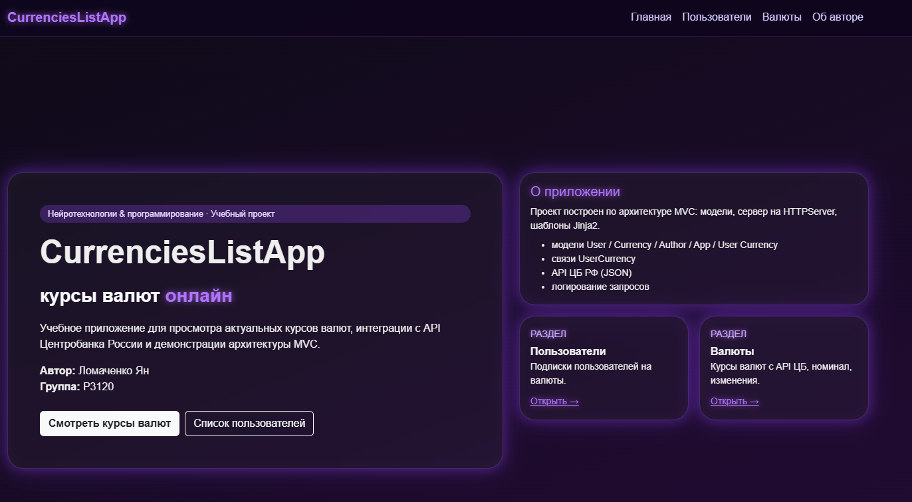
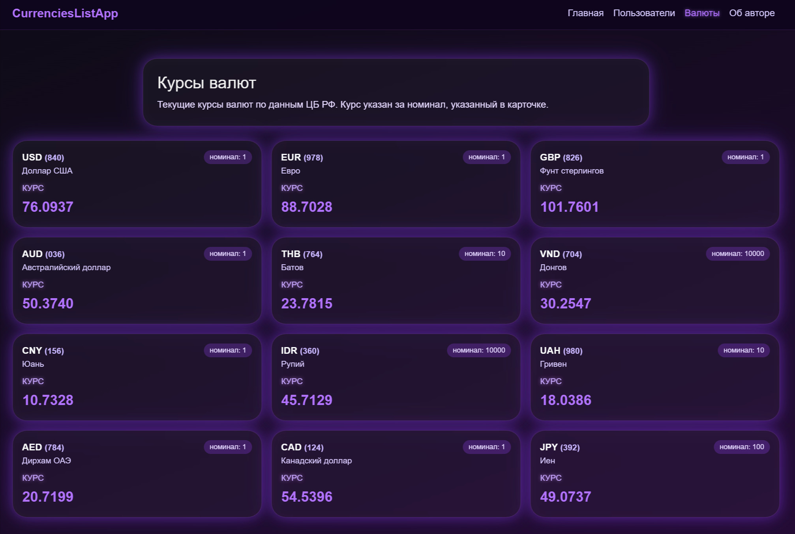
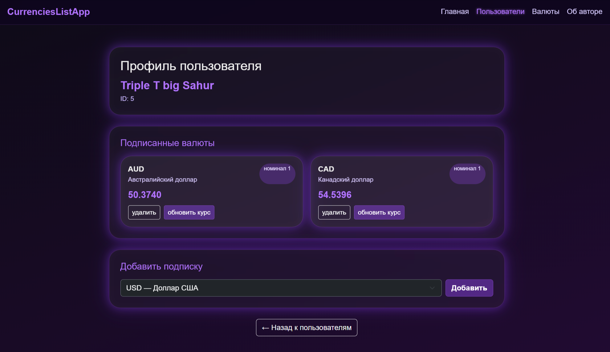
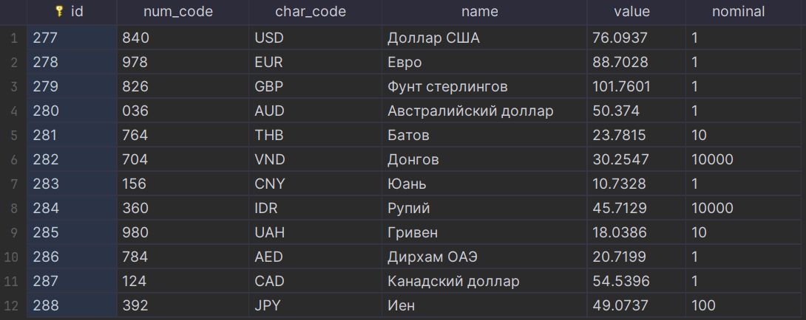
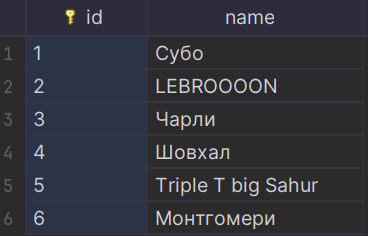
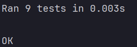

title: CRUD для приложения отслеживания курсов валют c SQLite базой данных

---

# **1. Цель работы**

* Реализовать CRUD (Create, Read, Update, Delete) для сущностей бизнес-логики приложения.
* Освоить работу с SQLite (режим in-memory и файл).
* Понять принципы первичных и внешних ключей и их роль в связях между таблицами.
* Выделить контроллеры для работы с БД и для рендеринга страниц в отдельные модули.
* Использовать архитектуру MVC и соблюдать разделение ответственности.
* Отображать пользователям таблицу с валютами, на которые они подписаны.
* Реализовать полноценный роутер, который обрабатывает GET-запросы и выполняет сохранение/обновление данных и рендеринг страниц.
* Научиться тестировать функционал на примере сущностей currency и user с использованием unittest.mock.

---

# **2. Описание моделей, их свойств и связей**

## **2.1. User**

| Поле   | Тип | Описание         |
| ------ | --- | ---------------- |
| `id`   | int | Первичный ключ   |
| `name` | str | Имя пользователя |

Валидация:

* ID > 0
* Имя ≥ 2 символов

**Связь:**
User (1) — (N) UserCurrency

---

## **2.2. Currency**

| Поле        | Тип   | Описание                   |
| ----------- | ----- | -------------------------- |
| `id`        | int   | Primary Key                |
| `num_code`  | str   | Числовой код валюты        |
| `char_code` | str   | Символьный код (USD, EUR…) |
| `name`      | str   | Название валюты            |
| `value`     | float | Текущий курс               |
| `nominal`   | int   | Номинал                    |

Валидация:

* курс > 0
* номинал > 0
* символьный код длиной 2–5 символов

---

## **2.3. UserCurrency**

Таблица связи **многие-ко-многим**.

```sql
CREATE TABLE user_currency (
    id INTEGER PRIMARY KEY AUTOINCREMENT,
    user_id INTEGER NOT NULL,
    currency_id INTEGER NOT NULL,
    FOREIGN KEY (user_id) REFERENCES user(id),
    FOREIGN KEY (currency_id) REFERENCES currency(id)
);
```

---

# **3. Структура проекта с назначением файлов**

```
lab_9/
│
├── controllers/
│   ├── currencycontroller.py      # бизнес-логика валют
│   ├── databasecontroller.py      # CRUD + SQL
│   └── __init__.py
│
├── models/
│   ├── user.py                    # модель User
│   ├── currency.py                # модель Currency
│   ├── user_currency.py           # модель связи
│   ├── author.py                  # информация об авторе
│   ├── app.py                     # модель приложения
│   └── __init__.py
│
├── templates/
│   ├── index.html                 # главная страница
│   ├── users.html                 # список пользователей
│   ├── user.html                  # профиль пользователя
│   ├── currencies.html            # таблица валют
│   ├── author.html                # информация об авторе
│
├── utils/
│   └── currencies_api.py          # получение курсов валют с API
│
├── tests/
│   ├── test_currency_model.py
│   ├── test_user_model.py
│   ├── test_currency_controller.py
│
├── currency.db                    # база SQLite
└── myapp.py                       # веб-сервер и маршрутизация
```

---

# **4. Реализация CRUD с примерами SQL-запросов**

## **4.1. CREATE**

```sql
INSERT INTO currency (num_code, char_code, name, value, nominal)
VALUES (?, ?, ?, ?, ?);
```

Python:

```python
cursor.execute(sql, (
    currency.num_code,
    currency.char_code,
    currency.name,
    currency.value,
    currency.nominal
))
```

---

## **4.2. READ**

Все валюты:

```sql
SELECT * FROM currency;
```

По char_code:

```sql
SELECT * FROM currency WHERE char_code = ?;
```

---

## **4.3. UPDATE**

```sql
UPDATE currency SET value = ? WHERE char_code = ?;
```

---

## **4.4. DELETE**

```sql
DELETE FROM currency WHERE id = ?;
```

---

# **5. Скриншоты работы приложения**

### **5.1. Главная страница ( / )**



### **5.2. Таблица валют ( /currencies )**



### **5.3. Профиль пользователя ( /user?id=1 )**



### **5.4. Пример Баз данных:*




# **6. Примеры тестов с unittest.mock и результаты их выполнения**

## ✔ Тест модели Currency

```python
def test_invalid_value_raises(self):
    with self.assertRaises(ValueError):
        Currency(currency_id=1, char_code="USD", value=-5, nominal=1)
```

---

## ✔ Тест модели User

```python
def test_invalid_name(self):
    with self.assertRaises(ValueError):
        User(user_id=1, name="A")
```

---

## ✔ Тест контроллера с mock БД

```python
def test_list_currencies(self):
    mock_db = MagicMock()
    mock_db.read_all.return_value = [{"id": 1, "char_code": "USD"}]

    controller = CurrencyController(mock_db)
    result = controller.list_currencies()

    assert result[0]["char_code"] == "USD"
    mock_db.read_all.assert_called_once()
```

---

## ✔ Пример вывода:



---

# **7. Выводы о применении MVC, работе с SQLite, обработке маршрутов и рендеринге шаблонов**

1. В работе реализована полноценная архитектура MVC:

   * **Модели** отвечают за данные и валидацию.
   * **Контроллеры** выполняют обработку действий и CRUD с SQLite.
   * **Представления (Views)** рендерятся через Jinja2.
   * **Router (myapp.py)** обрабатывает GET-маршруты.

2. SQLite позволила создать надёжную, связную структуру таблиц с внешними ключами.

3. CRUD для Currency успешно реализован и протестирован.

4. Реализована страница **профиля пользователя**, на которой отображаются подписки (many-to-many).

5. Система маршрутизации обрабатывает:

   * вывод валют
   * обновление
   * удаление
   * отображение профиля
   * добавление/удаление подписок

6. Тестирование с `unittest.mock` позволило изолировать бизнес-логику и полностью покрыть контроллеры без обращения к базе данных.

7. Приложение полностью соответствует требованиям: форматы, типы, PEP-8, PEP-257, MVC, маршруты, тесты, CRUD.

