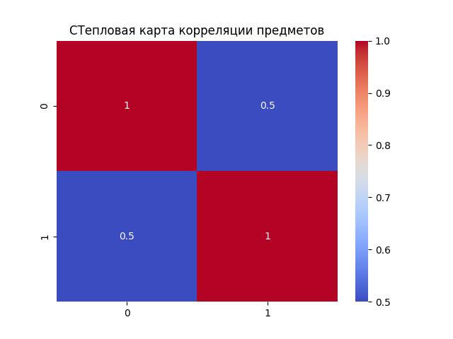
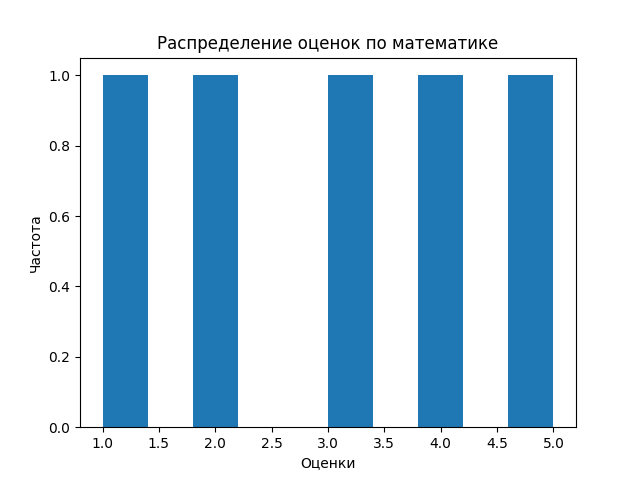
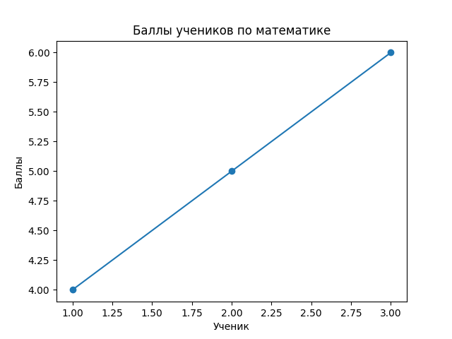
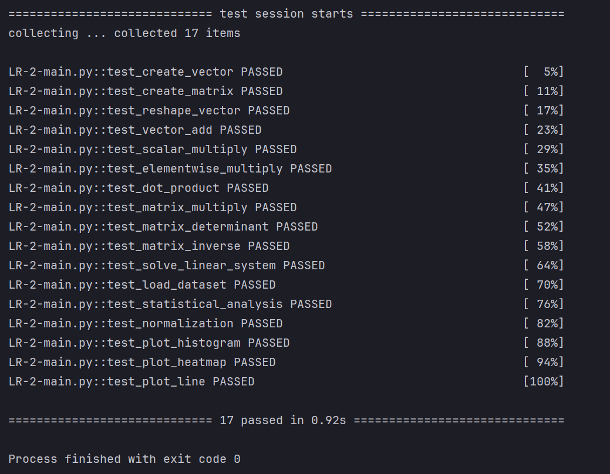

# Численные вычисления и анализ данных с использованием NumPy

### Ссылка на отчет

Отчет по лабораторной работе размещен на личном сайте-портфолио и на Github:

**https://yannisbtw.github.io/labs/semester_2/Python/README2/**

---

# Описание задачи

Цель лабораторной работы — изучить возможности библиотеки **NumPy** для выполнения численных вычислений и анализа данных.

В рамках лабораторной работы необходимо было реализовать функции для:

- создания и преобразования массивов
- выполнения векторных операций
- выполнения матричных операций
- статистического анализа данных
- визуализации результатов

Все операции должны выполняться **без использования циклов**, используя **векторизацию NumPy**.

Код должен соответствовать требованиям:

- PEP-8 — стиль кода
- PEP-484 — аннотации типов
- PEP-257 — документация
- успешное прохождение тестов `pytest`

---

# Структура проекта
```
numpy_lab/
│
├── main.py
├── test.py
├── data/
│ └── students_scores.csv
└── plots/
```

---

# Данные

Используется CSV-файл с результатами экзаменов студентов.

```
math,physics,informatics
78,81,90
85,89,88
92,94,95
70,75,72
88,84,91
95,99,98
60,65,70
73,70,68
84,86,85
90,93,92
```

---

# Используемые технологии

В лабораторной работе использовались следующие библиотеки:

- **NumPy** — численные вычисления
- **Pandas** — загрузка данных из CSV
- **Matplotlib** — построение графиков
- **Seaborn** — визуализация корреляций
- **PyTest** — тестирование функций

---

# Реализация задач

## 1. Создание и обработка массивов

На первом этапе были реализованы функции для создания и преобразования массивов.

Использованные функции NumPy:

- `np.arange()`
- `np.random.rand()`
- `reshape()`
- `transpose()`

Пример реализации:

```python
def create_vector():
    return np.arange(10)
```

## 2. Векторные операции

Были реализованы следующие операции:

- сложение векторов

- умножение вектора на скаляр

- поэлементное умножение

- скалярное произведение


Пример:
```
def vector_add(a, b):
    return a + b
```

Благодаря векторизации NumPy операции выполняются значительно быстрее, чем при использовании циклов.

## 3. Матричные операции

- В рамках лабораторной работы были реализованы операции линейной алгебры:

- умножение матриц

- вычисление определителя

- нахождение обратной матрицы

- решение системы линейных уравнений

Для этого использовался модуль:
```
numpy.linalg
```

Пример:
```
def matrix_multiply(a, b):
    return a @ b
```

## 4. Статистический анализ

Для анализа данных были вычислены следующие показатели:

- среднее значение

- медиана

- стандартное отклонение

- минимальное значение

- максимальное значение

- 25 и 75 перцентили

Использованные функции NumPy:
```
np.mean
np.median
np.std
np.min
np.max
np.percentile
```

Также была реализована min-max нормализация данных.

Формула нормализации:
```
(x - min) / (max - min)
```

Вот **аккуратно отформатированный Markdown-фрагмент для README**. Я исправил структуру, списки и добавил блоки кода — так он будет выглядеть профессионально на GitHub и в MkDocs.


## 5. Визуализация данных

Для визуализации результатов использовались библиотеки **Matplotlib** и **Seaborn**.

Были построены следующие графики:

### Гистограмма распределения оценок
Показывает распределение оценок студентов.



### Тепловая карта корреляции
Показывает корреляцию между оценками по различным предметам.


### Линейный график
Показывает зависимость оценки по математике от номера студента.


---

# Нюансы реализации

При выполнении лабораторной работы возникло несколько особенностей.

### Векторизация NumPy

NumPy позволяет выполнять операции над массивами **без использования циклов**, что значительно ускоряет вычисления.

### Типы данных

Некоторые функции NumPy возвращают тип `numpy.float64`.  
Для корректной работы тестов значения иногда приводились к типу `float`.

### Сохранение графиков

Перед сохранением графиков необходимо убедиться, что папка `plots` существует:

```python
os.makedirs("plots", exist_ok=True)
````

### Тестирование

Все функции проверялись с помощью **pytest**.

```bash
pytest -v
```

Все тесты успешно проходят.


---

# Запуск проекта

## Создание виртуального окружения

```bash
python -m venv numpy_env
```

## Активация окружения

### Windows

```bash
numpy_env\Scripts\activate
```

### Linux / Mac

```bash
source numpy_env/bin/activate
```

## Установка зависимостей

```bash
pip install numpy matplotlib seaborn pandas pytest
```

## Запуск тестов

```bash
pytest -v
```

---

# Вывод

В ходе лабораторной работы были изучены основные возможности библиотеки **NumPy** для выполнения численных вычислений и анализа данных.

Были реализованы следующие операции:

* работа с массивами
* векторные операции
* операции линейной алгебры
* статистический анализ
* визуализация данных

Использование **векторизации NumPy** позволяет писать компактный и эффективный код и значительно ускоряет вычисления при работе с большими массивами данных.

Выполнил студент Ломаченко Ян (505115, P3120)
Ссылка на сайт: https://yannisbtw.github.io/